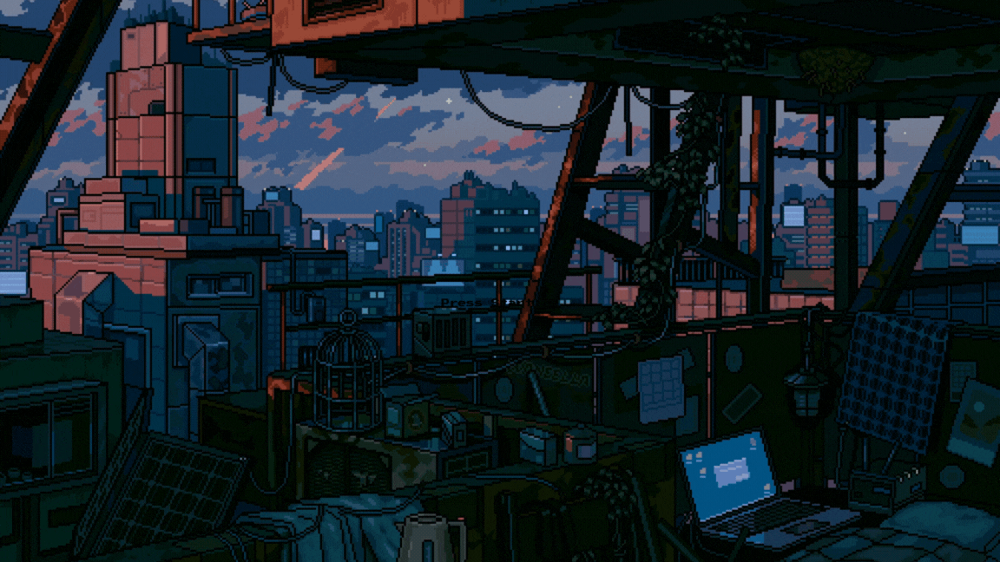

<!-- Header Wave with Text Overlay -->
<div align="center" style="position: relative; width: 100%;">
  
  <div style="position: absolute; top: 50%; left: 50%; transform: translate(-50%, -50%); text-align: center; color: white; text-shadow: 2px 2px 8px rgba(0,0,0,0.8);">
    <h1 style="font-size: 3.5em; margin: 0; font-weight: bold;">Sachin Mehar</h1>
    <p style="font-size: 1.5em; margin: 10px 0 0 0;">Full-Stack Developer | MERN Specialist</p>
  </div>
</div>

<div align="center">
  <a href="#">
    
  </a>
</div>

<!-- Typing Animation -->
<p align="center">
  <a href="https://git.io/typing-svg"></a>
</p>

<!-- Profile Badges -->
<div align="center">
  <a href="https://github.com/Sachinmehar21" target="_blank">
    </a>
  <a href="https://github.com/Sachinmehar21?tab=repositories&sort=stargazers" target="_blank">
    </a>
  <a href="https://github.com/Sachinmehar21?tab=followers" target="_blank">
    </a>
</div>

<br/>

<!-- About Me Section with GIF -->


<h2>💫 About Me</h2>

```javascript
const sachin = {
  location: "Bhopal, India 🇮🇳",
  role: "Full-Stack Developer",
  workingOn: "Building scalable web applications",
  learning: "System Design & Cloud Architecture",
  askMeAbout: ["MERN", "Next.js", "UI/UX", "APIs"],
  funFact: "I debug with console.log and I'm proud of it! 🐛",
};
```

<p>
  🚀 Expert in <strong>MERN Stack</strong> (MongoDB, Express.js, React.js, Node.js)<br/>
  ⚡ Crafting with <strong>Next.js</strong> for blazing-fast applications<br/>
  🎨 Designing <strong>intuitive & responsive</strong> user interfaces<br/>
  🌱 Currently exploring <strong>Cloud Technologies & DevOps</strong><br/>
  💡 Open to collaborating on <strong>innovative projects</strong>
</p>

<br clear="both"/>

---

<!-- Connect Section -->
<h2 align="center">🔗 Connect With Me</h2>
<div align="center">
  <a href="mailto:sachinmehar21@gmail.com">
    </a>
  <a href="https://linkedin.com/in/sachinmehar" target="_blank">
    </a>
  <a href="https://instagram.com/sachinmeharr" target="_blank">
    </a>
  <a href="https://x.com/sachinmehar21" target="_blank">
    </a>
  <a href="https://medium.com/@Sachinmehar21" target="_blank">
    </a>
</div>

<br/>

---

<!-- GitHub Stats Section -->
<h2 align="center">📊 GitHub Statistics</h2>
<div align="center">
  
  
</div>


<br/>

<!-- Activity Graph -->
<div align="center">
  
</div>

<br/>

---

<!-- Tech Stack Section -->
<h2 align="center">🛠️ Tech Stack & Tools</h2>

<h4 align="center">💻 Languages</h4>
<div align="center">
  
</div>

<h4 align="center">🚀 Frameworks & Libraries</h4>
<div align="center">
  
</div>

<h4 align="center">🗄️ Databases & Cloud</h4>
<div align="center">
  
</div>

<h4 align="center">🔧 Tools & Platforms</h4>
<div align="center">
  
</div>

<br/>

---

<!-- Detailed Tech Badges -->
<h2 align="center">⚡ Technology Expertise</h2>
<div align="center">
  
  
  
  
  
  
  
  
  
  
  
  
  
  
  
  
</div>

<br/>

---

<!-- Featured Repositories -->
<h2 align="center">⭐ Featured Projects</h2>
<div align="center">
  <a href="https://github.com/Sachinmehar21/Sachinmehar21">
    </a>
</div>

<br/>

---

<!-- Contribution Snake -->
<h2 align="center">🐍 Contribution Graph</h2>
<div align="center">
  <picture>
    <source media="(prefers-color-scheme: dark)" srcset="https://raw.githubusercontent.com/platane/snk/output/github-contribution-grid-snake-dark.svg">
    <source media="(prefers-color-scheme: light)" srcset="https://raw.githubusercontent.com/platane/snk/output/github-contribution-grid-snake.svg">
    
  </picture>
</div>

<br/>

---

<!-- Support Section -->
<h2 align="center">☕ Support My Work</h2>
<p align="center">
  <a href="https://www.buymeacoffee.com/sachinmehar">
    
  </a>
</p>

<br/>

---

<!-- Quote -->
<div align="center">
  
</div>

<br/>

<!-- Footer Wave -->
<div align="center">
  
</div>

<!-- Footer Text -->
<p align="center">
  
</p>

<p align="center">
  ✨ <strong>Designed with 💜 by Sachin Mehar</strong> ✨
</p>

<p align="center">
  
</p>
